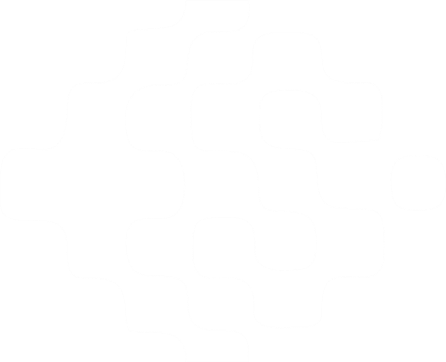

# 🚀 Divine Okorie | Portfolio

  
  <h3 align="center">Front-End Developer & Creative Designer</h3>
  

    Crafting seamless user experiences, visually engaging web applications, and compelling creative content.
     
    <a href="https://didi168.github.io/"><strong>Explore the Website »</strong></a>
     
     
    • <a href="#-about-me">About Me</a> 
    • <a href="#-tech-stack">Tech Stack</a> 
    • <a href="#-featured-projects">Featured Projects</a> 
    • <a href="#-contact">Contact</a> •
  

---

### 🌟 About Me
I am a skilled and innovative **Front-End Developer** and **Creative Designer** with a passion for building modern, responsive, and user-focused web experiences. My unique blend of technical expertise and creative design allows me to deliver high-quality digital solutions from concept to code.

- 🌍 Based in **Port Harcourt, Nigeria**.
- 🎓 B.Sc. in **Environmental Biology** (University of Port Harcourt).
- 💡 Passionate about **UI/UX**, **Motion Graphics**, and **Frontend performance**.

---

### 💻 Tech Stack

#### Web Development

#### Creative Design & Tools

---

### 📂 Featured Projects

| Project | Tech Stack | Live Demo |
| :--- | :--- | :--- |
| **Oud Alkhairy** | HTML, CSS, JS, SEO | [View Project](https://oudalkhairy.com/) |
| **Emcelo** | React.js, API Integration | [View Project](https://emecelo.vercel.app/) |
| **Philtechs Academy** | HTML5, CSS3, JS | [View Project](https://education.philtechs.org/) |
| **Finzorex** | React, API, SEO | [View Project](https://app.finzorex.com/) |
| **Zippy Pay** | HTML, CSS, SEO | [View Project](https://zippyafricpay.com/) |
| **Weeyba** | Next.js, TypeScript | [View Project](https://front-end-weeyba.vercel.app/) |

---

### 🎨 Creative Showcase
Beyond coding, I specialize in:
- 🎬 **Video Editing**: High-energy promotional videos and social media ads.
- ✨ **Motion Graphics**: 2D animations and kinetic typography.
- 📐 **Graphic Design**: Brand identities, logos, and marketing fliers.

---

### 🤝 Contact
Let's build something amazing together!

- 📧 Email: [divineoko2018@gmail.com](mailto:divineoko2018@gmail.com)
- 💼 LinkedIn: [dues-softdesigns](https://www.linkedin.com/in/dues-softdesigns)
- 🐦 Twitter: [@DivineOkorie3](https://twitter.com/DivineOkorie3)
- 💬 WhatsApp: [+234 812 223 2066](https://wa.me/2348122232066)
- 🐙 GitHub: [didi168](https://github.com/didi168)

---

  Built with ❤️ by Divine Okorie

